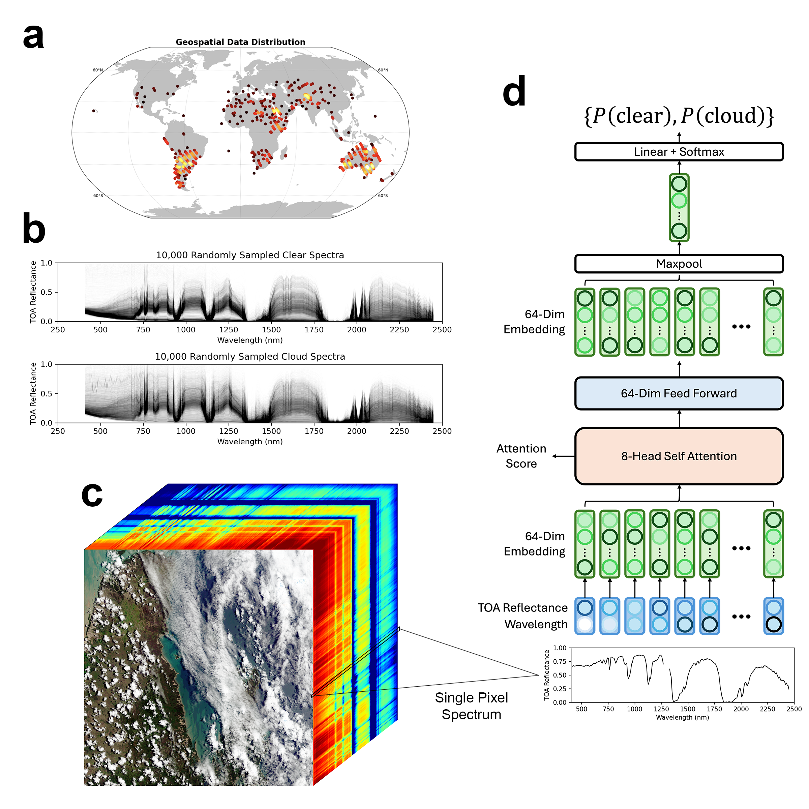

# SpecTf: Transformers Enable Data-Driven Imaging Spectroscopy Cloud Detection

Jake H. Lee, Michael Kiper, David R. Thompson, Philip G. Brodrick. *In Review.*

Preprint: https://arxiv.org/abs/2501.04916




## Description

This repository contains the source code used to implement, evaluate, and deploy the SpecTf for EMIT Cloud Masks.

The datasets associated with this repository are available at:

> Lee, J., Kiper, M., Thompson, D. R., & Brodrick, P. (2025). Dataset for "Spectroscopic Transformer for Improved EMIT Cloud Masks" [Data set]. Zenodo. https://doi.org/10.5281/zenodo.14607937

> [!NOTE]
> This repository will be modified in the future to use the parent-level installable model package.

### Scripts and Subdirectories

- `datasets/`
    - Contains descriptions and definitions for the ML-ready datasets used to train and validate the SpecTf model.
- `evaluation/`
    - Contains evaluation scripts to produce performance metrics reported in Table 1.
- `figures/`
    - Contains scripts and Jupyter notebooks to produce figures reported in the paper, as well as raw figures.
- `comparison_models/`
    - Contains scripts to reproduce the GBT and ANN comparison models reported in the paper.
- `arch.yml`
    - Plaintext definition of model architecture parameters.
- `dataset.py`
    - Pytorch dataloader for the ML-ready datasets for model training and EMIT scene rasters for deployment
- `deploy_spectf_cloud.py`
    - **Primary script to produce EMIT Cloud Masks.** See [Usage](#Usage) for details.
- `irr.npy`
    - Solar irradiance data for Top-of-Atmosphere calculation.
- `model.py`
    - SpecTf model architecture definition in Pytorch.
- `README.md`
    - This file.
- `toa.py`
    - Helper script for calculating the Top-of-Atmosphere Reflectance in-memory.
- `train_spectf_cloud.py`
    - **Script to reproduce/retrain the SpecTf Cloud model.** See [Usage](#Usage) for details.
- `utils.py`
    - Various utility functions. Contains `drop_banddef()`, which drops specific wavelengths from EMIT spectra.
- `weights.pt`
    - SpecTf model weights.


## Usage

### Using SpecTf to cloud mask your EMIT Scene

**1. Download the L1B raster products**

EMIT L1B At-Sensor Calibrated Radiance and Geolocation Data is available from the LPDAAC: https://lpdaac.usgs.gov/products/emitl1bradv001/

**2. Run SpecTf**

```
% python deploy_spectf_cloud.py --help
Threads: 10
usage: deploy_spectf_cloud.py [-h] [--keep-bands] [--proba]
                              [--weights WEIGHTS] [--irradiance IRRADIANCE]
                              [--arch-spec ARCH_SPEC] [--device DEVICE]
                              [--threshold THRESHOLD]
                              rdnfp obsfp outfp

Produce a transformer-generated cloud mask.

positional arguments:
  rdnfp                 Filepath to L1b radiance .hdr file
  obsfp                 Filepath to L1b observation .hdr file
  outfp                 Filepath to output .hdr file

options:
  -h, --help            show this help message and exit
  --keep-bands          Keep all bands in the spectra (use for non-EMIT data)
  --proba               Output probability map instead of binary cloud mask
  --weights WEIGHTS     Filepath to trained model weights (default: weights.pt)
  --irradiance IRRADIANCE
                        Filepath to irradiance numpy file (default: irr.npy)
  --arch-spec ARCH_SPEC
                        Filepath to model architecture YAML specification
                        (default: arch.yml)
  --device DEVICE       Device specification for PyTorch (-1 for CPU, 0+ for
                        GPU, default: -1, MPS if available)
  --threshold THRESHOLD
                        Threshold for cloud classification (default: 0.52)
```

**Example: Reproducing the SpecTf cloud mask in Figure 2a:**

```
python deploy_spectf_cloud.py \
    emit20240302t005829_o06201_s000_l1b_rdn_b0106_v01.hdr \
    emit20240302t005829_o06201_s000_l1b_obs_b0106_v01.hdr \
    emit20240302t005829_o06201_s000_spectf_cloudmask.hdr \
    --weights       weights.pt \
    --irradiance    irr.npy \
    --arch-spec     arch.yml
```

### Reproduce/Retrain the SpecTf Cloud model

**1. Download the datasets from Zenodo into `datasets/`**

The ML-ready dataset is available at:

> Lee, J., Kiper, M., Thompson, D. R., & Brodrick, P. (2025). Dataset for "Spectroscopic Transformer for Improved EMIT Cloud Masks" [Data set]. Zenodo. https://doi.org/10.5281/zenodo.14607938

**2. Run the training script**

To reproduce the reported SpecTf model:

```
% python train_spectf_cloud.py \
    datasets/spectf_cloud_labelbox.hdf5 \
    datasets/spectf_cloud_mmgis.hdf5 \
    --train-csv     datasets/train_fids.csv \
    --test-csv      datasets/test_fids.csv \
    --outdir        out/ \
    --wandb-entity  <Weights and Biases entity> \
    --wandb-project <Weights and Biases project> \
    --wandb-name    <Weights and Biases run name> \
    --epochs        30 \
    --batch         256 \
    --lr            0.0001 \
    --gpu           0 \
    --arch-ff       64 \
    --arch-heads    8 \
    --arch-dropout  0.05 \
    --arch-agg      max \
    --arch-proj-dim 64 
```

**Complete documentation:**

```
% python train_spectf_cloud.py --help
usage: train_spectf_cloud.py [-h] --train-csv TRAIN_CSV --test-csv TEST_CSV
                             [--outdir OUTDIR] [--wandb-entity WANDB_ENTITY]
                             [--wandb-project WANDB_PROJECT]
                             [--wandb-name WANDB_NAME] [--epochs EPOCHS]
                             [--batch BATCH] [--lr LR] [--gpu GPU]
                             [--arch-ff ARCH_FF] [--arch-heads ARCH_HEADS]
                             [--arch-dropout ARCH_DROPOUT]
                             [--arch-agg {mean,max,flat}]
                             [--arch-proj-dim ARCH_PROJ_DIM]
                             dataset [dataset ...]

Train a classification model on tiled methane data.

positional arguments:
  dataset               Filepaths of the hdf5 datasets.

options:
  -h, --help            show this help message and exit
  --train-csv TRAIN_CSV
                        Filepath to train FID csv.
  --test-csv TEST_CSV   Filepath to test FID csv.
  --outdir OUTDIR       Output directory for models. Defaults to ./outdir.
  --wandb-entity WANDB_ENTITY
                        WandB project to be logged to.
  --wandb-project WANDB_PROJECT
                        WandB project to be logged to.
  --wandb-name WANDB_NAME
                        Project name to be appended to timestamp for wandb
                        name.
  --epochs EPOCHS       Number of epochs for training. Default is 50.
  --batch BATCH         Batch size for training. Default is 256.
  --lr LR               Learning rate for training. Default is 0.0001.
  --gpu GPU             GPU device to use. Default is -1 (cpu).
  --arch-ff ARCH_FF     Feed-forward dimensions. Default is 64.
  --arch-heads ARCH_HEADS
                        Number of heads for multihead attention. Default is 8.
  --arch-dropout ARCH_DROPOUT
                        Dropout percentage for overfit prevention. Default is
                        0.1.
  --arch-agg {mean,max,flat}
                        Aggregate method prior to classification. Default is
                        'max'.
  --arch-proj-dim ARCH_PROJ_DIM
                        Projection dimensions. Default is 64.
```