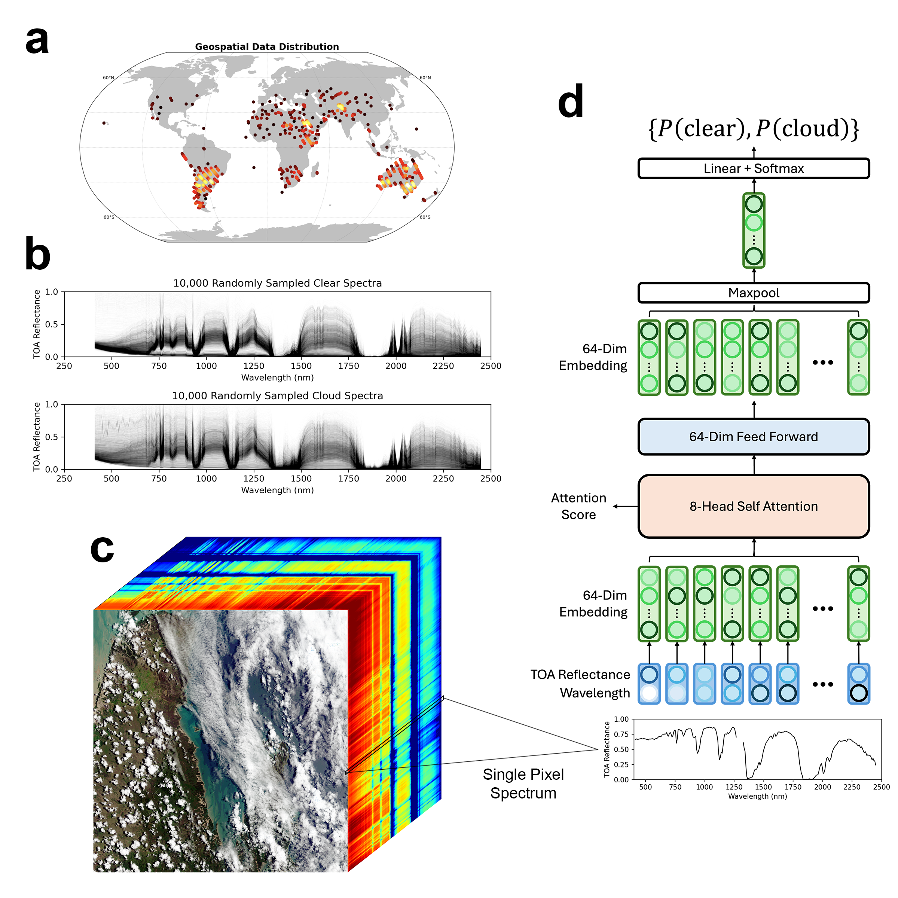

# SpecTf: Transformers Enable Data-Driven Imaging Spectroscopy Cloud Detection

Jake H. Lee, Michael Kiper, David R. Thompson, Philip G. Brodrick. *In Review.*

Preprint: https://arxiv.org/abs/2501.04916




## 📝 Description

This repository contains the source code used to implement, evaluate, and deploy the SpecTf for EMIT Cloud Masks.

This is a specific implementation of the SpecTf model.

The datasets associated with this repository are available at:

> Lee, J., Kiper, M., Thompson, D. R., & Brodrick, P. (2025). Dataset for "Spectroscopic Transformer for Improved EMIT Cloud Masks" [Data set]. Zenodo. https://doi.org/10.5281/zenodo.14607937


## 💾 Installation
To install the `SpecTf Cloud` python package to use as both:
- An importable Python3 package
- A CLI interface for model training and deployment
follow the below instructions:

1. [Install GDAL](https://gdal.org/en/stable/download.html) 
    - If you have trouble installing, try `conda install -c conda-forge gdal`
2. `make dev-install` from the repository root. (Running `make dev-install-tensorrt` will install the optional packages for the TensorRT runtime with `spectf-cloud deploy-trt` command)
3. Future versions will be deployed on PyPI.


## 📁 Project Directory Structure
Here's an overview of the key files and directories in this repository:

### **Directories**
| Directory | Description |
|-----------|------------|
| **`datasets/`** | Descriptions and definitions for ML-ready datasets used for training and validation. |
| **`evaluation/`** | Scripts to evaluate the model with the test dataset and produce performance metrics. |
| **`comparison_models/`** | Scripts to reproduce the GBT and ANN comparison models from the paper. |

---

### **Key Files**
| File | Description |
|------|------------|
| **`dataset.py`** | PyTorch dataloader for ML-ready datasets and EMIT scene rasters. |
| **`deploy/deploy_pt.py`** | Primary script to produce EMIT Cloud Masks. See [Usage](#Usage) for details. |
| **`irr.npy`** | Solar irradiance data for Top-of-Atmosphere calculations. |
| **`model.py`** | SpecTf model architecture definition in PyTorch. |
| **`toa.py`** | Helper script for calculating the Top-of-Atmosphere Reflectance in-memory. |
| **`train.py`** | Training script to retrain/reproduce the SpecTf Cloud model. See [Usage](#Usage) for details. |
| **`spectf_cloud_config.yml`** | Plaintext definition of model architecture parameters. |
| **`weights.pt`** | Pretrained SpecTf model weights. |

---

### **Notes**
- The `deploy/deploy_pt.py` and `train.py` scripts are the **main entry points** for model inference and training.
- `datasets/` and `evaluation/` contain **important assets** for benchmarking the model.

## 💽 Dataset
The datasets are [availible on zenodo](https://doi.org/10.5281/zenodo.14607937)
- [download Labelbox data](https://zenodo.org/records/14614218/files/spectf_cloud_lbox.hdf5?download=1)
- [download MMGIS data](https://zenodo.org/records/14614218/files/spectf_cloud_mmgis.hdf5?download=1)

There are 2 datasets used in the inital training of SpecTf Cloud for our publication:
1. An initial round of data collection and labeling done on [Labelbox](https://labelbox.com)
2. A second round of data collected from [MMGIS](https://popo.jpl.nasa.gov/mmgis/?mission=EMIT), targeting the false positives and negatives from an inital model trained with only the Labelbox data

Within each of these datasets, there the following fields:
| Name | Description | Info |
|-----------|------------|------------|
| **spectra** | These are the spectra used for training after specific lost signal-to-noise bands were removed (see `spectf_cloud_config.` for which bands) | Shape: (1841641, 268), Dtype: float64 |
| **labels** | Discrete lass of the spectra - `0` for Clear and `1` for Cloud | Shape: (1841641,), Dtype: int64 |
| **fids** | The FID of to which the spectra belongs to | Shape: (1841641,), Dtype: string |
| **bands** | The wavelengths values (nm) for each band in the spectra - needed for the SpecTf encoding | Shape: (268,), Dtype: float64 - Is an attribute of the dataset|
| **indices** | These are the X, Y pixel coordinates of the spectra from the FID image | Shape: (1841641, 2), Dtype: int64 |


## 🚀 Usage
At any point, you can navigate the CLI with the `-h` `--help` flags 
```
$ spectf-cloud -h

 Usage: spectf-cloud [OPTIONS] COMMAND [ARGS]...

╭─ Options ─────────────────────────────────────────────────────────────────────────────────────────────╮
│ --version        Display the current SpecTf version.                                                  │
│ --help     -h    Show this message and exit.                                                          │
╰───────────────────────────────────────────────────────────────────────────────────────────────────────╯
╭─ Commands ────────────────────────────────────────────────────────────────────────────────────────────╮
│ cloud-eval             Evaluation commands for SpecTf and L2A Baseline.                               │
│ deploy-pt              Produce a SpecTf transformer-generated cloud mask using PyTorch runtime.       │
│ deploy-trt             Produce a SpecTf transformer-generated cloud mask using the TensorRT engine.   │
│ train                  Train the SpecTf Hyperspectral Transformer Model.                              │
│ train-comparison       Training commands for the ResNet and XGBoost comparison models.                │
│ tui                    Open Textual TUI.                                                              │
╰───────────────────────────────────────────────────────────────────────────────────────────────────────╯
```

### 🌈 Using `SpecTf Cloud` to cloud mask your EMIT Scene ☁️

**1. Download the L1B raster products**

EMIT L1B At-Sensor Calibrated Radiance and Geolocation Data is available from the LPDAAC: https://lpdaac.usgs.gov/products/emitl1bradv001/

**2. [Install SpecTf Cloud](#Installation)**

Verify it's installed properly with
```
$ which spectf-cloud
<some-version>
```

**2. Use the CLI to Run SpecTf Cloud**

```
$ spectf-cloud deploy-pt -h

 Usage: spectf-cloud deploy-pt [OPTIONS] OUTFP OBSFP RDNFP

 Produce a SpecTf transformer-generated cloud mask.

╭─ Options ────────────────────────────────────────────────────────────────────────────────────────────────────────────╮
│ --threshold       FLOAT    Threshold for cloud classification. [default: 0.52]                                       │
│ --device          INTEGER  Device specification for PyTorch (-1 for CPU, 0+ for GPU, MPS if                          │
│                            available).                                                                               │
│                            [default: -1]                                                                             │
│ --arch-spec       FILE     Filepath to model architecture YAML specification. [default: spectf_cloud_config.yml]     │
│ --irradiance      FILE     Filepath to irradiance numpy file. [default: irr.npy]                                     │
│ --weights         FILE     Filepath to trained model weights. [default: weights.pt]                                  │
│ --proba                    Output probability map instead of binary cloud mask.                                      │
│ --keep-bands               Keep all bands in the spectra (use for non-EMIT data).                                    │
│ --help        -h           Show this message and exit.                                                               │
╰──────────────────────────────────────────────────────────────────────────────────────────────────────────────────────╯
```

Example:
```
$ spectf-cloud deploy-pt /path/to/outfile /path/to/obsfile /path/to/radiance/file
```

> **NOTE:** The TensorRT reuntime deployment is ~25% faster than the PyTorch runtime deployment, but requires an additional set of dependancies. To use `spectf-cloud deploy-trt`, please download `pip3 install spectf[deploy-runtime]`

### 👨‍🔬 Reproduce/Retrain the SpecTf Cloud model 🚂

**1. Download the datasets from Zenodo into `datasets/`**

The ML-ready dataset is available at:

> Lee, J., Kiper, M., Thompson, D. R., & Brodrick, P. (2025). Dataset for "Spectroscopic Transformer for Improved EMIT Cloud Masks" [Data set]. Zenodo. https://doi.org/10.5281/zenodo.14607938

**2. Run the training script**

To reproduce the reported SpecTf Cloud model:

```
$ spectf-cloud train \
    datasets/spectf_cloud_labelbox.hdf5 \
    datasets/spectf_cloud_mmgis.hdf5 \
    --seed          42 \
    --train-csv     datasets/train_fids.csv \
    --test-csv      datasets/test_fids.csv \
    --outdir        out/ \
    --wandb-entity  <Weights and Biases entity> \
    --wandb-project <Weights and Biases project> \
    --wandb-name    <Weights and Biases run name> \
    --epochs        30 \
    --batch         256 \
    --lr            0.0001 \
    --gpu           0 \
    --arch-ff       64 \
    --arch-heads    8 \
    --arch-dropout  0.05 \
    --arch-agg      max \
    --arch-proj-dim 64 
```

**All training options:**
```
$ spectf-cloud train --help

 Usage: spectf-cloud train [OPTIONS] DATASET...

 Train the SpecTf Hyperspectral Transformer Model.

╭─ Options ───────────────────────────────────────────────────────────────────────────────────────────────╮
│    --save-every-epoch                       Save the model's state every epoch.                         │
│    --seed                  INTEGER          Training run seed. [default: 42]                            │
│    --arch-proj-dim         INTEGER          Projection dimensions. [default: 64]                        │
│    --arch-agg              [mean|max|flat]  Aggregate method prior to classification. [default: max]    │
│    --arch-dropout          FLOAT            Dropout percentage for overfit prevention. [default: 0.1]   │
│    --arch-heads            INTEGER          Number of heads for multihead attention. [default: 8]       │
│    --arch-ff               INTEGER          Feed-forward dimensions. [default: 64]                      │
│    --gpu                   INTEGER          GPU device to use.                                          │
│    --lr                    FLOAT            Learning rate for training. [default: 0.0001]               │
│    --batch                 INTEGER          Batch size for training. [default: 256]                     │
│    --epochs                INTEGER          Number of epochs for training. [default: 50]                │
│    --wandb-name            TEXT             Project name to be appended to timestamp for wandb name.    │
│                                             [default: ""]                                               │
│    --wandb-project         TEXT             WandB project to be logged to. [default: ""]                │
│    --wandb-entity          TEXT             WandB entity. [default: ""]                                 │
│    --outdir                TEXT             Output directory for models. [default: ./outdir]            │
│ *  --test-csv              FILE             Filepath to test FID csv. [required]                        │
│ *  --train-csv             FILE             Filepath to train FID csv. [required]                       │
│    --help              -h                   Show this message and exit.                                 │
╰─────────────────────────────────────────────────────────────────────────────────────────────────────────╯
```