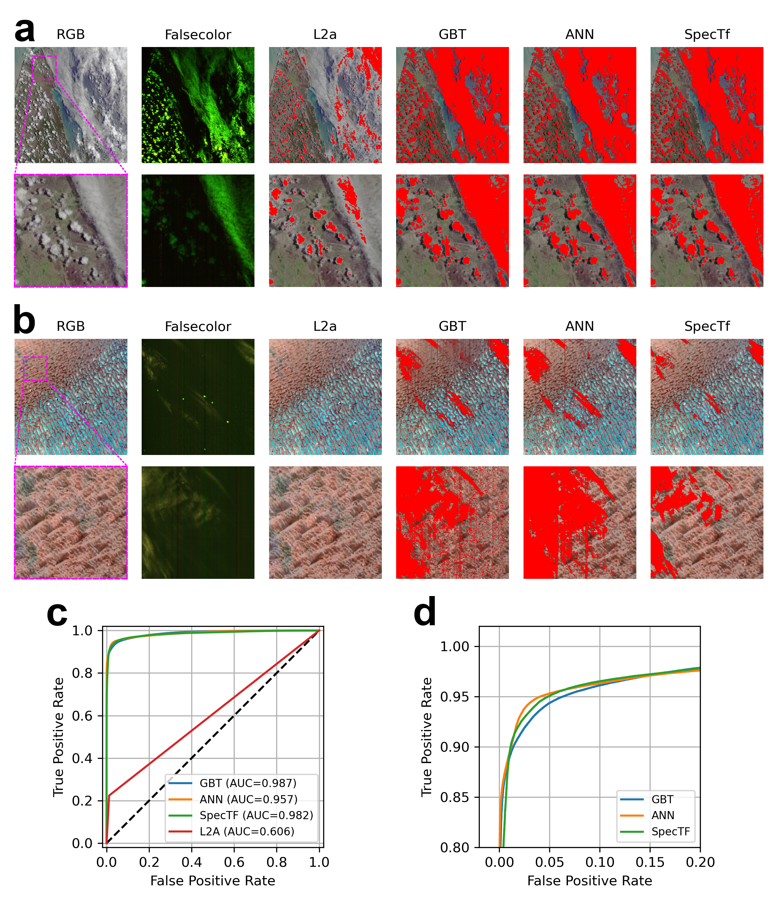
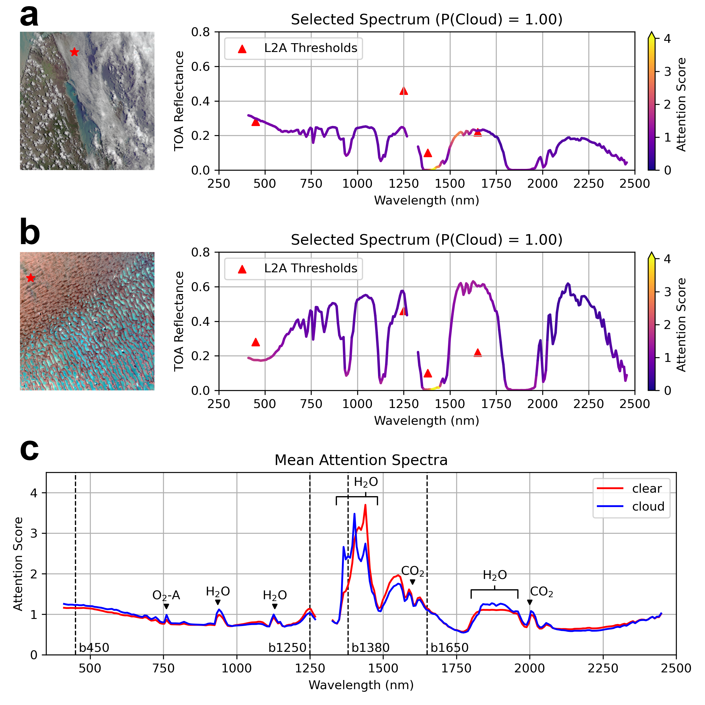

# Figures

This directory contains scripts to reproduce the figures reported in "SpecTf: Transformers Enable Data-Driven Imaging Spectroscopy Cloud Detection"

## Figure 2

- `Fig2_rocauc.ipynb` saves the ROC AUC curves of each model to `.npy` files.
- `Fig2.ipynb` produces all subfigures of Figure 2 using existing mask rasters and the produced `.npy` files.

## Figure 3

- `Fig3_ab.ipynb` produces subfigures a and b, extracting attention weights by running the SpecTf model on an input.
- `Fig3_attn.ipynb` extracts attention weights from the entire dataset, saving them to `.npy` files (these can be several gigabytes).
- `Fig3_c.ipynb` calculates the mean attention spectrum from the produced `.npy` files to produce Figure 3c.
